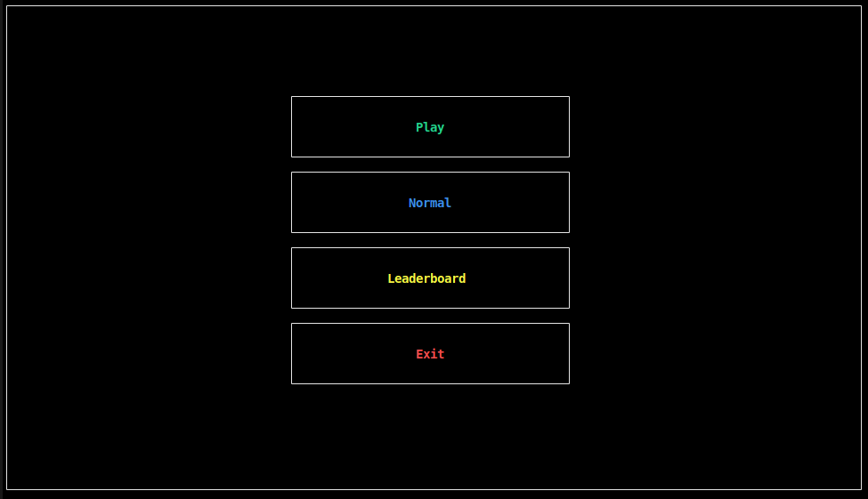

# Snake Game

## About the project
This is a project made by 3 students from the University of Bologna for their Programming course.
The given guidelines regarding the project were to create a simple terminal-based snake videogame in the c++ programming language, specifically using the graphics library *curses/ncurses.h* and the basic programming concepts learnt during the lectures.

### Structure of the project's codebase
The project has been structured and developed follwoing the 'MVC' programming framework, and 
its core is in the *'/src'* folder where:
- the *'main.cpp'* file is the starting point of the Snake Game program
- the *'/game'* folder is where all the necessary classes for the logic and control sections(*following the MVC framework*) are stored
- the *'/graphics'* folder is where all the necessary classes for the various graphical components are stored 

## Installation and dependency tools
Following are the steps required to play the game:
* Make sure to have installed the ncurses library on your machine
* Make sure to have correctly configured the GCC compiler(compiler used to create and test this project)
* Install and configure CMake to be used to build the project and being able to run it (i.g. if using the VsCode environment, there is the microsoft extention named *'CMake Tools'* to make this process easier and faster)
* After correctly building the project(without errors) using CMake, run the project and the program will show the *following GUI on the terminal screen*:
    

## How to play
After running the project, the user will be shown the main terminal screen where he can:
* Click Play 
    * after clicking Play the user will be shown the list of the available levels, and by clicking one of them he will start playing 
    * by clicking 'q' on the keyboard the user will be able to **pause the game**, then the options *'Resume'* and *'Exit'* will be available to him.
* Click the currently set difficulty set the game difficulty     
    * by clicking the second button, the user will be able to set the desired difficulty level(*'Normal'*, *'Hard'* or *'Easy'*)
* Click Leaderboard
    * by clicling this third button, a new screen containing a list of levels(grouped based on the 3 different difficulties) and the points gained so far in each of these levels will be shown
    * by clicking 'q' on the keyboard the user will be able to go back to the home screen
* Click Exit
    * if this last button is clicked, the user will exit and terminate the program
    
## Authors 
* Caprini Federico (*'aintDatCap'*)
* Grillinin Leonardo (*'LeonardoGrillini'*)
* Hossain Ababil (*'AbaSkillzz'*)

